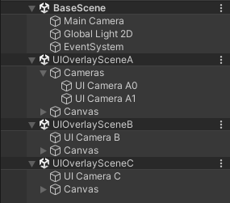
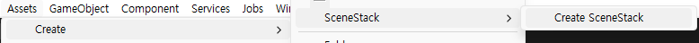
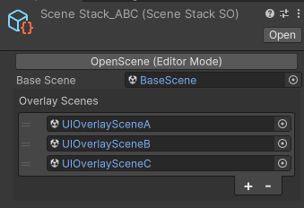
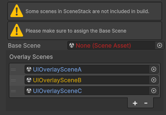
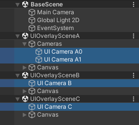
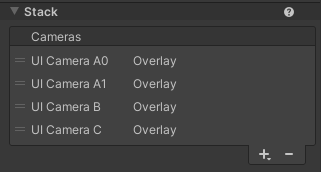
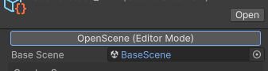
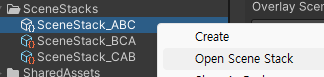
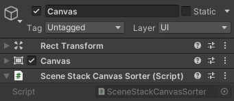
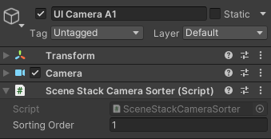

# SceneStack
SceneStack is a multi-scene management system with URP CameraStack support.

## Features
- Multi-scene management
- URP Camera Stacking support
  - Find and add all overlay cameras across scene to the base camera.
  - Removes annoying cross-Scene reference warnings by referencing overlay cameras from another scene.

## Usage

### UI Scene
Using SceneStack, UI camera & canvas can be managed in separate scenes.  


You can create a UI scene by these steps.
1. Create a Scene.
2. Add a UI camera with Render Type - Overlay and Culling Mask - UI.  
3. Add a canvas with Screen Space - Camera and set Render Camera to your UI camera.

For more information of this usage, please refer to the `UISceneSample` sample project in the package’s details panel.

## Guide

### Getting started
#### 0. Prerequisites
SceneStack requires Unity 2022.x+ and URP with camera stack support.
#### 1. Install from a Git URL
Add the following line to the dependencies section of your project's manifest.json file.
```json
"com.malcha.scenestack": "git+https://github.com/GeonhanLee/SceneStack.git?path=/Packages/SceneStack"
```
#### 2. Namespace
Add `using Malcha.SceneStack;`

### SceneStackSO
You can create your own `SceneStack` with `SceneStackSO` in the editor.

Create `SceneStackSO` using the menu `Assets > Create > SceneStack > Create SceneStack`.  
  
Assign your scene to the base scene field in the inspector.  
You can also add overlay scenes as a stack.  


`SceneStackSO` gives you warning in the inspector if base scene is missing or some scenes in the `SceneStack` are not in build.  


### Configure SceneStack in runtime
You can clone `SceneStack` from your `SceneStackSO`.
```cs
public SceneStack ExampleCloneSceneStack(SceneStackSO so)
{
  return so.CloneSceneStack();
}
```
or you can construct your own `SceneStack` without `SceneStackSO`.
```cs
SceneStack stack = new SceneStack("BaseScene");
// stack.baseScene = new SceneData("BaseScene"); is also ok.
stack.overlayScenes = new List<SceneData>
{
  new SceneData("Assets/SampleScenes/UIOverlaySceneA.unity"),
  new SceneData("UIOverlaySceneB"),
  new SceneData("SampleScenes/UIOverlaySceneC")
};
```
You can fill the class `SceneData`'s constructor with the name or path of the scene as [`SceneManager.LoadScene`](https://docs.unity3d.com/ScriptReference/SceneManagement.SceneManager.LoadScene.html).

### CameraStack
Overlay cameras in scenes included in the `SceneStack` will be added to base camera when `SceneStack` is loaded.  
  
The order of cameras in camera stack is equivalent to the order of belonged scene in the `SceneStack`.  
  

### Open SceneStack in editor mode
You can open your `SceneStack` in editor mode by clicking the button on `SceneStackSO`,  


or right click the `SceneStackSO` in the project window and select `Open Scene Stack` menu.  



### Load SceneStack in runtime
You can load `SceneStack` using a static class, `SceneStackLoader` in runtime.
```cs
public void ExampleLoadSceneStackSO(SceneStackSO so)
{
  SceneStackLoader.LoadSceneStack(so);
}
public void ExampleLoadSceneStack(SceneStack ss)
{
  SceneStackLoader.LoadSceneStack(ss);
}
```

### SceneStackCanvasSorter 
The raycast order of canvas across multiple scenes with same sorting order is not guranteed.  
To fix this, `SceneStackCanvasSorter` sets the `sortingOrder` of a canvas to the index of a scene which belongs to.

Add `SceneStackCanvasSorter` component to your canvas object.  


### SceneStackCameraSorter
Camera is sorted in the camera stack with an index of its belonged scene.  
If you want to sort the cameras in the same scene, use the `SceneStackCameraSorter` component.

Add `SceneStackCameraSorter` component to your Camera object and modify Sorting Order in the inspector window. The lower sorting order is rendered first.  


## Internal Operations

### SceneStackSOManager
`SceneStackSOManager` Reserializes all `SceneStackSO` by `ReserializeAllSceneStackSO()`.

The method is called when below occurs.  
1. `ExitingEditMode`
2. `OnPreprocessBuild`
3. `OnPostprocessAllAssets` : when SceneAsset is imported / deleted / moved

`ReserializeAllSceneStackSO()` automatically saves dirtied `SceneAssetSO` when called.  
This is because `AssetDatabase.ForceReserializeAssets()` serializes before the modification is applied.

### SceneStackWarningSuppressor
`SceneStackWarningSuppressor` removes annoying warnings on the editor by removing cross scene references when entering/exiting playmode.  

It also selects and deselects camera when entering/exiting playmode to remove the error message below.  
https://forum.unity.com/threads/indexoutofrangeexception-in-urp.1306230


## Limits & To-Do
The list below is not currently supported.
- Multiple base camera (e.g. split screen, render texture)
- Async scene loading

## Credits & Similar Projects
SceneStack is heavily inspired by these projects. 
- [Eflatun.SceneReference](https://github.com/starikcetin/Eflatun.SceneReference)
  - Unlike `Eflatun.SceneReference`, SceneStack doesn't generate a Scene GUID to Path Map. Instead, SceneStack reserializes all `SceneStackSO`.
  - SceneStack doesn't provide SceneReference API to user.
- [CarterGames/MultiScene](https://github.com/CarterGames/MultiScene)
## License
This project is licensed under the terms of the MIT License.
Refer to the [LICENSE.md](./Packages/SceneStack/LICENSE.md) file.